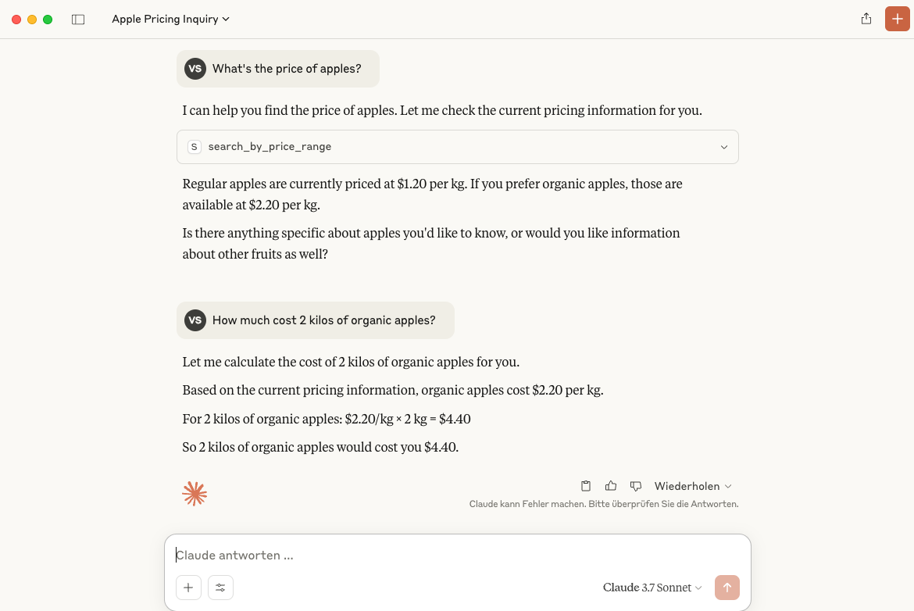

# mcp-server-trial

This is a trial of the MCP server based on [Building an MCP Server in Cursor — Learning MCP Through Practice](https://medium.com/@darrell.tw.martech/building-an-mcp-server-in-cursor-learning-mcp-through-practice-979110df56c2)

This project is implemented with [Windsurf Editor](https://windsurf.com/editor) using [Claude 3.7 Sonnet](https://www.anthropic.com/claude/sonnet) and [MCP Python SDK](https://github.com/modelcontextprotocol/python-sdk).

More specifically, Windsurf created this project based on the downloaded [README.md from the MCP Python SDK](README-mcp-python-sdk.md) and the following prompt:  
"Read the document README-mcp-python-sdk.md and implement an MCP Server based on this document in the current directory, featuring a simulated fruit and vegetable price query scenario."

Additionally, it created a MCP server description file [README-fruit-veg.md](README-fruit-veg.md).

The MCP server can be added to Claude desktop by running
```bash
mcp install fruit_veg_server.py --name "Fruit & Vegetable Market"
```

Here is an example usage of this MCP server in Claude desktop: 


It can also be tested with MCP inspector starting with
```bash
mcp dev fruit_veg_server.py
```
MCP inspector is then running at [http://127.0.0.1:6274/#resources](http://127.0.0.1:6274/#resources).